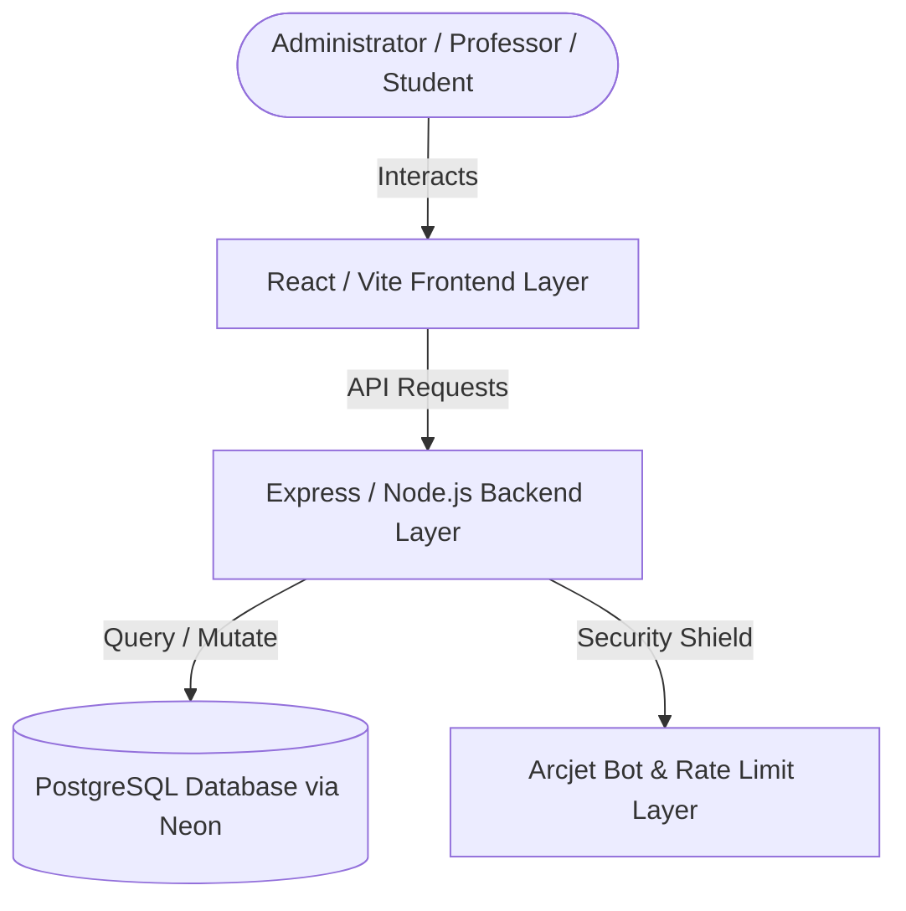
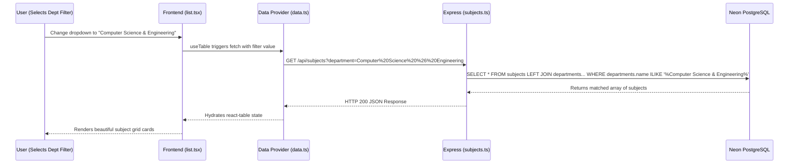

# Academic Hub Platform - Technical Architecture Blueprint

This document details the architectural design, component layers, data flows, and system blueprints of the **Academic Hub Platform**.

---

## System Overview

The Academic Hub Platform is a high-performance **University Management System (UMS)** constructed with a decoupled **decoupled client-server architecture**. It provides real-time departmental statistics, dynamic timetable mappings, curriculum syllabus blueprints, and robust learning management system (LMS) assignments features.

---

## Architectural Layers

### 1. Presentation & UI Layer (Frontend)
Located in `classroom-frontend/`, this is a React single-page application powered by **Vite** and **Tailwind CSS**. It is structured for rapid state responses and highly customizable themes.

* **Core Framework**: **Refine Framework v4/v5** for automatic data routing, list view generators, and automated form mappings.
* **Component Directory Layout**:
  * `src/pages/dashboard.tsx`: The primary analytical dashboard. Implements a reactive configuration panel allowing live accent theme changes in the DOM (e.g. *Tech Violet MIT*, *Cambridge Slate*) using inline style root CSS custom properties.
  * `src/pages/subjects/`: Grid catalog displaying curriculum structures and syllabus blueprinters matching nested departmental types.
  * `src/pages/classes/`: Directories for classroom management, student enrollments, and teacher assignments.
  * `src/components/refine-ui/`: Unified UI components (notifications, data-tables, filter panels) matching glassmorphic, premium visual systems.
  * `src/components/ui/`: Underlying accessible primitive elements powered by Radix primitives and Tailwind styling.

### 2. State & Data Hydration Layer (Data Providers)
Serves as the translation layer between Refine's semantic triggers and REST APIs.

* **Custom Data Provider** (`src/providers/data.ts`):
  * Intercepts Refine's table queries and converts filters into optimized REST query parameters (e.g., mapping `field: 'department'` into query string `?department=Computer%20Science%20%26%20Engineering`).
  * Serializes backend response models into typed front-end schemas.
* **Types Definition** (`src/types/index.ts`):
  * Defines robust schemas for `Subject`, `Department`, `Classroom`, `UploadWidgetProps`, and `User` entities ensuring complete type safety.

### 3. API & Controller Layer (Backend Router)
A RESTful routing controller powered by **Express** and running on **Node.js** (`classroom-backend/`).

* **Subjects Router** (`src/routes/subjects.ts`): Supports paginated searches, full-text fuzzy string matches (`ilike`), and left-joins across departments.
* **Classes Router** (`src/routes/classes.ts`): Directs active class registry creations, invites codes generator hashes, and capacity metrics.
* **LMS Router** (`src/routes/lms.ts`): Governs homework assignments, text/file uploads, and grading schemas.
* **Users Router** (`src/routes/users.ts`): Returns institutional faculty rosters and student classifications.

### 4. Database Access Layer (Drizzle ORM)
Located in `classroom-backend/src/db/`, this is a fully typed database layer mapping straight to a Neon-hosted PostgreSQL instance.

* **Object-Relational Mapping (ORM)**: Powered by **Drizzle ORM**.
* **Database Models** (`src/db/schema/app.ts`):
  * `departments`: Master list of 8 core engineering disciplines (unique string codes, primary IDs, names).
  * `subjects`: Curriculum subjects with a foreign-key constraint referencing `departments.id`.
  * `classes`: Assigned class sections, invite code hashes, student capacities, and schedule JSON blocks linked to a specific subject and teacher.
  * `enrollments`: A composite-key table matching students to classes.
  * `announcements` & `comments`: Live feeds for individual sections.
  * `assignments` & `submissions`: Mapped task submission records with grade variables.

### 5. Security & Shielding Layer
Provides bulletproof rate-limiting and access shielding for API endpoints.

* **Arcjet Integration** (`classroom-backend/src/middleware/`): Uses Arcjet to analyze request signatures, rate-limit API calls, and detect automated bots.

---

## Core Data Flows

### A. Fetching and Filtering Subjects

---

## Environment Configuration

* **Frontend Variables** (`.env`):
  * `VITE_BACKEND_BASE_URL`: Specifies Backend base host route.
  * `VITE_CLOUDINARY_CLOUD_NAME`: Target for image upload payloads.
* **Backend Variables** (`.env`):
  * `DATABASE_URL`: Connection string for Neon serverless PostgreSQL.
  * `BETTER_AUTH_SECRET`: Secret key for token generation.
  * `ARCJET_KEY`: Key for Arcjet security middleware.
